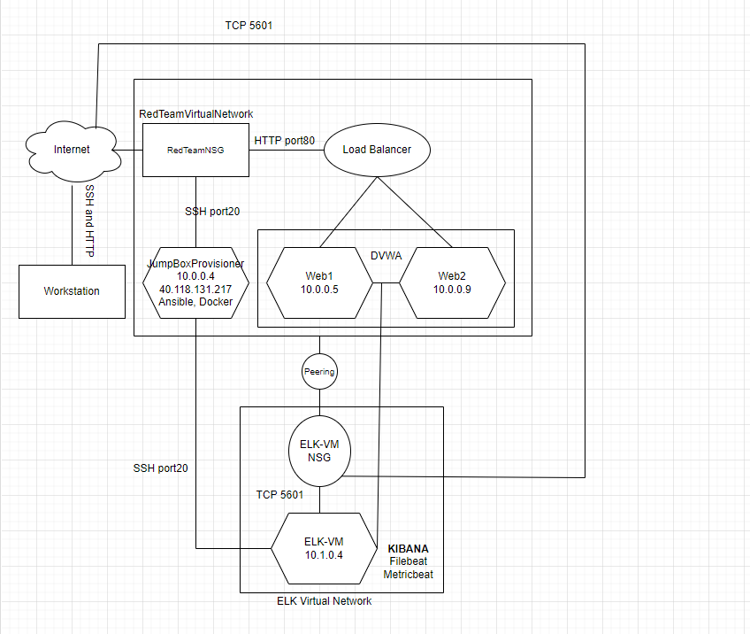
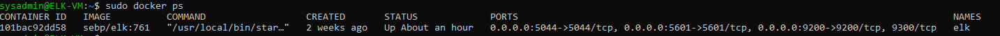

## Automated ELK Stack Deployment

The files in this repository were used to configure the network depicted below.

These files have been tested and used to generate a live ELK deployment on Azure. They can be used to either recreate the entire deployment pictured above. Alternatively, select portions of the YAML file may be used to install only certain pieces of it, such as Filebeat.

  elk_playbook.yml

This document contains the following details:
- Description of the Topologu
- Access Policies
- ELK Configuration
  - Beats in Use
  - Machines Being Monitored
- How to Use the Ansible Build

### Description of the Topology

The main purpose of this network is to expose a load-balanced and monitored instance of DVWA, the D*mn Vulnerable Web Application.

Load balancing ensures that the application will be highly responsive, in addition to restricting access to the network.
What aspect of security do load balancers protect? They prevent unwanted traffic, such as DDoS attacks, from overloading the application  What is the advantage of a jump box? Acts as an extra layer of security to manage internal servers

Integrating an ELK server allows users to easily monitor the vulnerable VMs for changes to the data and system logs.
What does Filebeat watch for? Monitors and collects  log files and reports them to logstash
What does Metricbeat record? Collects statistics and outputs the information in logstash 

The configuration details of each machine may be found below.
_Note: Use the [Markdown Table Generator](http://www.tablesgenerator.com/markdown_tables) to add/remove values from the table_.

| Name               | Function      | IP Address | Operating System |
|--------------------|---------------|------------|----------|
| JumpBoxProvisioner | Gateway       | 10.0.0.4   | Linux            |
| Web-1              | Webserver     | 10.0.0.5   | Linux            |
| Web-2              | Webserver     | 10.0.0.6   | Linux            |
| Web-3              | Webserver     | 10.0.0.9   | Linux            |
| ELK-VM             | ELK Webserver | 10.1.0.4   | Linux            |### Access Policies

The machines on the internal network are not exposed to the public Internet. 

Only the JumpBoxProvisioner machine can accept connections from the Internet. Access to this machine is only allowed from the following IP addresses:
40.118.131.217

Machines within the network can only be accessed by JumpBoxProvisioner.
Which machine did you allow to access your ELK VM? What was its IP address? JumpBoxProvisioner - 10.0.0.4

A summary of the access policies in place can be found in the table below.

| Name     | Publicly Accessible | Allowed IP Addresses |
|----------|---------------------|----------------------|
| Jump Box | Yes                 | 40.11.131.217        |
| Web-1    | No                  | 10.0.0.4             |
| Web-2    | No                  | 10.0.0.5             |
| Web-3    | No                  | 10.0.0.9             |
| ELK-VM   | No                  | 10.1.0.4             |

### Elk Configuration

Ansible was used to automate configuration of the ELK machine. No configuration was performed manually, which is advantageous because it allows you automate application deployment.
The playbook implements the following tasks:
docker.io, python3-pip, and docker module are installed
system memory is increased
listed the ports tha ELK runs on
enabled docker on boot
The following screenshot displays the result of running `docker ps` after successfully configuring the ELK instance.

### Target Machines & Beats
This ELK server is configured to monitor the following machines:
10.0.0.4, 10.0.0.5, 10.0.0.9

We have installed the following Beats on these machines:
Filebeat and Metricbeat

These Beats allow us to collect the following information from each machine:
Filebeat monitors and collects log files and forwards them to elasticsearch or logstash. Metric beat collects metrics and statistics and forwards them to elasticsearch or logstash as well.

### Using the Playbook
In order to use the playbook, you will need to have an Ansible control node already configured. Assuming you have such a control node provisioned: 

SSH into the control node and follow the steps below:
- Copy the ansible.cfg file to /etc/ansible
- Update the ansible.cfg file to include IP and ansible_python_interpreter=/usr/bin/python
- Run the playbook, and navigate to JumpBoxProvisioner to check that the installation worked as expected.

_TODO: Answer the following questions to fill in the blanks:_
- _Which file is the playbook? Where do you copy it? filebeat-playbook.yml etc/ansible/roles
- _Which file do you update to make Ansible run the playbook on a specific machine? How do I specify which machine to install the ELK server on versus which to install Filebeat on? By specifying the IP of the machine
- _Which URL do you navigate to in order to check that the ELK server is running? http://10.1.0.4/app/kibana

_As a **Bonus**, provide the specific commands the user will need to run to download the playbook, update the files, etc._
